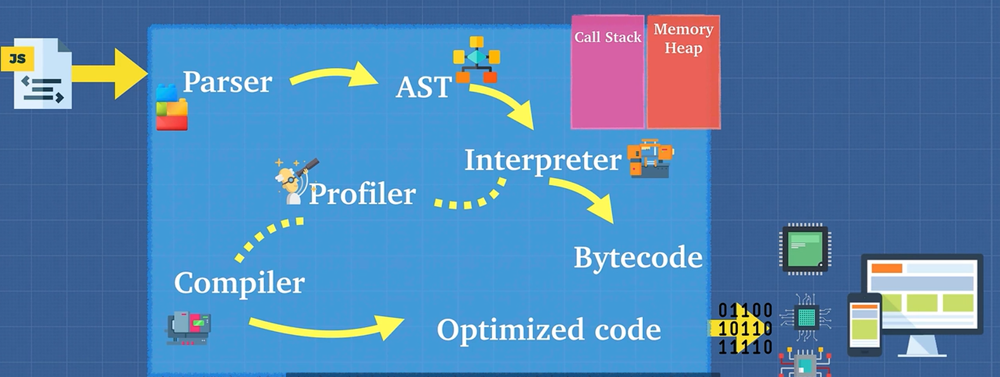

## js引擎



js并非是完全一门解释型语言，v8引擎也会对代码进行编译操作来优化代码。我们可以通过理解这些优化方式来编写更加高效的代码

下面是几个例子：

1. inline caching 内联缓存

2. hidden classes 隐藏类


## 奇怪的题

```javascript
var heyhey = function doodle(){
  doodle() //这里可以访问到
  return 'heyhey'
}

heyhey()
doodle() // ReferenceError: doodle is not defined
```

## 函数作用域与块作用域

在块作用域中，var定义的变量可以在外部访问到，但是在函数作用域中，var定义的变量只能在函数内部访问到。

而let和const定义的变量，只能在定义的块内部访问到。

## IIFE立即执行表达式

  ```javascript
  (function(){
    console.log('hello')
  })()
  ```
  
  或者

  ```javascript
  (function(){
    console.log('hello')
  }())
  ```
  解决了全局变量污染的问题